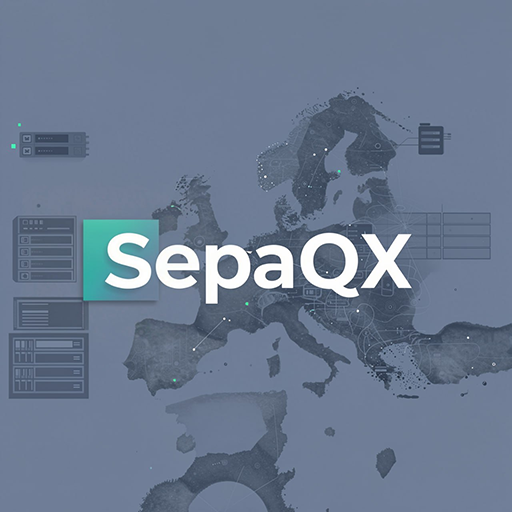

# SepaQX
<p align="center">
  <a href="https://safe-cap.com/sepaqx/" target="_blank">
    
  </a>
  <br><br>
  
</p>

SepaQX is a lightweight HTTP/HTTPS service for generating SEPA EPC QR codes (SCT) as PNG images.

Built for billing and invoice pipelines where deterministic output, strict validation, and production safety matter.

## At a Glance

- EPC-compliant SEPA QR generation
- Server mode and CLI mode
- Stable validation and error contract
- Automation-friendly JSON/exit behavior
- No external runtime dependencies

## Quick Start

Choose one path:

1. Server mode (Debian/Ubuntu + systemd): see [Install (Debian/Ubuntu)](https://github.com/safe-cap/sepaqx/wiki/Install-(Debian---Ubuntu))
2. CLI-only mode (any OS with Go): see [CLI Install (Any OS)](https://github.com/safe-cap/sepaqx/wiki/CLI-Install-(Any-OS))

Install details:
- Server (APT): https://github.com/safe-cap/sepaqx/wiki/Install-(Debian---Ubuntu)
- CLI/source (any OS): https://github.com/safe-cap/sepaqx/wiki/CLI-Install-(Any-OS)

## 1 API Example

```bash
curl -X POST "http://127.0.0.1:8089/sepa-qr" \
  -H "Content-Type: application/json" \
  -d '{
    "name": "Example GmbH",
    "iban": "DE12500105170648489890",
    "bic": "INGDDEFFXXX",
    "amount": "49,90",
    "amount_format": "eur_comma",
    "purpose": "GDDS",
    "remittance_text": "Invoice 2026-0001"
  }' \
  --output sepa-qr.png
```

## 1 CLI Example

```bash
./sepaqx generate \
  --scheme "epc_sct" \
  --name "Example GmbH" \
  --iban "DE12500105170648489890" \
  --bic "INGDDEFFXXX" \
  --amount "49,90" \
  --amount-format "eur_comma" \
  --out sepa-qr.png
```

## Why Teams Choose SepaQX

- Deterministic results for the same normalized input
- Strict input validation before PNG generation
- Public mode or API-key mode for controlled rollout
- Per-key branding (logo/palette/gradients/styles)
- Clear health/readiness/version endpoints for operations

## Stability / Compatibility

- `/sepa-qr` and `/sepa-qr/validate` are intended to remain stable and backward compatible.
- New capabilities are additive where possible.
- Current release notes: [CHANGELOG.md](CHANGELOG.md)

Compatibility matrix:

| Surface | Stability |
| --- | --- |
| `POST/GET/HEAD /sepa-qr` contract | Stable |
| `POST /sepa-qr/validate` JSON shape (`ok/error_code/details/field/request_id`) | Stable |
| CLI `generate --format json` fields (`ok/payload/amount_cents`) | Stable |
| CLI batch summary fields (`ok/total/succeeded/failed/items`) | Stable |
| Test runner exit code mapping (`matrix=1`, `cli-e2e=2`, `load=4`, `all=bitmask`) | Stable |
| New fields/options (e.g. `amount_format`) | Additive |

## AI/Automation Contract

- https://github.com/safe-cap/sepaqx/wiki/AI-Automation-Contract

## Full Documentation (Wiki)

- [Home](https://github.com/safe-cap/sepaqx/wiki)
- [Quick Start](https://github.com/safe-cap/sepaqx/wiki/Quick-Start)
- [API](https://github.com/safe-cap/sepaqx/wiki/API)
- [Configuration](https://github.com/safe-cap/sepaqx/wiki/Configuration)
- [CLI Usage](https://github.com/safe-cap/sepaqx/wiki/CLI-Usage)
- [AI / Automation Contract](https://github.com/safe-cap/sepaqx/wiki/AI-Automation-Contract)
- [OCR Amount Input Guidelines](https://github.com/safe-cap/sepaqx/wiki/OCR-Amount-Input-Guidelines)
- [Security & Production Notes](https://github.com/safe-cap/sepaqx/wiki/Security-&-Production-Notes)
- [Internal LAN Runbook](https://github.com/safe-cap/sepaqx/wiki/Deployment-Runbook-(Internal-LAN))

## License

Apache-2.0
